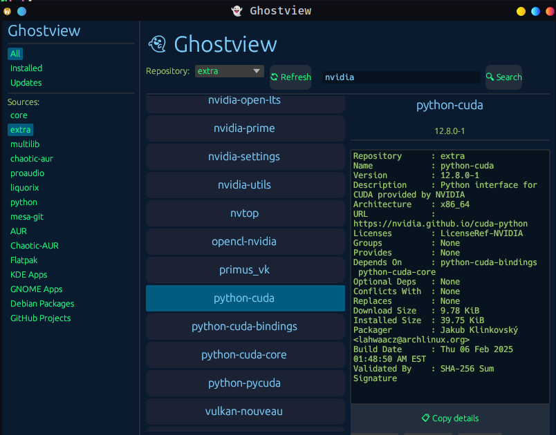

# 👻 GhostView

> ✨ A sleek, modular GUI for discovering and managing packages across the Arch Linux ecosystem — built with Rust and egui.

---

## 🎯 What is GhostView?

**GhostView** is a beautiful, lightweight desktop interface for exploring the best Linux packages — powered by [`ghostbrew`](https://github.com/ghostkellz/ghostbrew) under the hood.

Browse and manage:

- 📦 **Pacman** (GUI + system packages)
- 🎯 **AUR** and **Chaotic-AUR** (planned)
- 📦 **Flatpak** (from Flathub & custom remotes, planned)
- 🧩 **KDE/GNOME apps** (planned)
- 🧰 Curated **GitHub repositories** for essential Linux tools (planned)
- 🐧 Future: Snap, AppImage, and Debian package support

---

## 💡 Key Features (Planned)

| Feature | Status |
|--------|--------|
| 🔍 Unified package search (Pacman, AUR, Flatpak) | 🚧 Pacman GUI working |
| 🖥️ Modern egui-based UI | ✅ In Progress |
| 🧙 Ghostbrew backend integration (via Rust) | 🛠️ Next up |
| 📚 GitHub repo listing (tagged & categorized) | 🧪 Experimental |
| 📡 Connect to self-hosted AUR or Flatpak remotes | 🔜 |
| 🛠️ Launch, uninstall, update apps | 🔜 |
| 🤖 Local LLM recommendation engine (optional) | 🔭 Exploration |

---

## ⚙️ Tech Stack

- 🦀 **Rust** for the backend and core logic
- 🎨 **egui/eframe** for the native, cross-platform GUI (Wayland/KDE/X11/Windows/macOS)
- 🐧 Native Linux/Wayland support (no web stack)

---

## 📦 Goals

GhostView is built to:
- Provide a **clean and fast** native GUI for Arch package management
- Respect user choice — no snap, no flatpak spam, no bloated services
- Work offline when needed
- Eventually link to your own **ghostbrew-repo** or mirror server

---

## 🔮 Future Vision

- 🌐 Push and sync to `ghostbrew-repo` (custom AUR-like hosting)
- 📦 Serve `.pkg.tar.zst` files via GhostGate or direct NGINX
- 🧠 Smart search and tagging via LLMs
- 📲 Optional mobile/web dashboard
- 🔒 Optional auth layer for remote access

---

## 🧙‍♂️ Get Involved

Help us build the future of Arch GUI tools:

- [ ] Submit feature ideas, bugs, or PRs
- [ ] Help wire in advanced package formats (Snap, AppImage)
- [ ] Add Ghostbrew data parsing modules in Go

---

© 2025 [CK Technology](https://cktechx.com) / [GhostKellz](https://ghostkellz.sh) – Licensed under [MIT](LICENSE)
